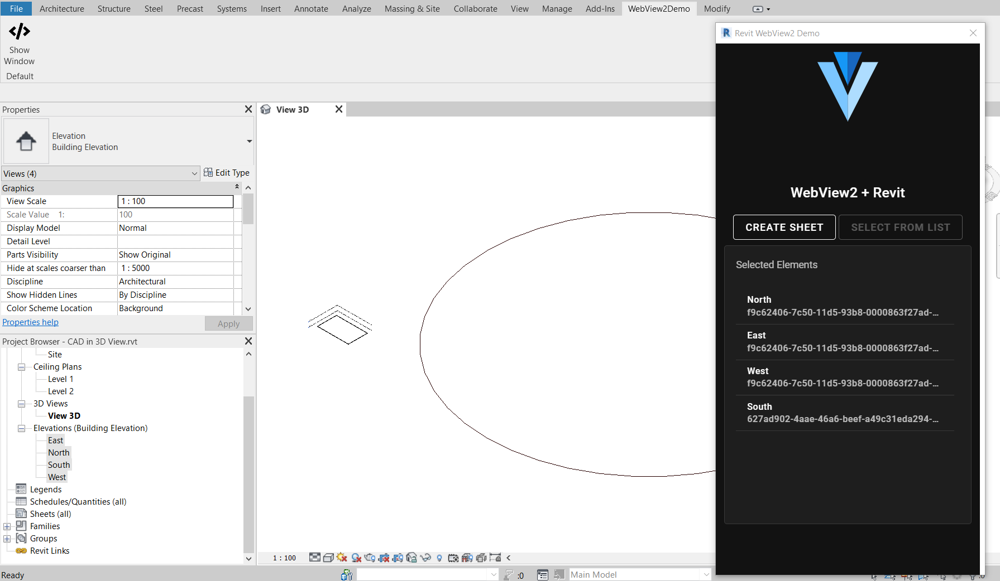
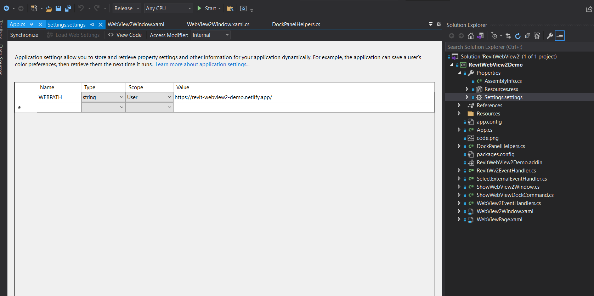

# Revit WebView2 Demo

Prototype for a web interface within Autodesk Revit using WPF + WebView2.

Web apps built with any modern web frameworks can run in the setup demonstrated in this project.
This example uses a web UI built with `Vue.js` with `Vuetify`. The web app is currently hosted [here](https://revit-webview2-demo.netlify.app/).



All Revit interactions from and to the Web UI is defined in [here](web/src/utils/webview2.js)


## Installation

- download `RevitWebView2Demo.zip` from [here](https://github.com/zahmadsaleem/revit-webview2-demo/releases/download/1.0.0/RevitWebView2Demo.zip) 
- extract the zip to your revit add-ins folder
- make sure the dlls are not blocked

Current release of `RevitWebView2Demo` was developed with Revit 2021. It should work fine with older versions as well.

## Development Setup

First things first, clone this repository

### Web

- Follow [these](web/README.md) instructions

### Revit
- open `RevitWebView2.sln`
- restore packages and relink missing dlls
- debug/build
## How To

### <u>Change URL End Point</u>



### Passing data between WebView and Revit

#### <u>Communicate from Web UI To Revit</u>

```js
export function postWebView2Message({ action, payload }) {
  if (!action) {
    return;
  }
  // `window.chrome.webview` is only available in webview context
  // you can pass anything as the parameter to postMessage
  // C# will receive it as serialized json
  // { action, payload } is defined for the sake of having a standard message schema
  window.chrome?.webview?.postMessage({ action, payload });
}
```

C# handles the [`WebMessageReceived`](https://github.com/zahmadsaleem/revit-webview2-demo/blob/cd9b8d5ce690964bfa1db953666c5482ce9ee7c1/RevitWebView2Demo/WebViewPage.xaml.cs#L53) received event, when [`postMessage`](https://github.com/zahmadsaleem/revit-webview2-demo/blob/cd9b8d5ce690964bfa1db953666c5482ce9ee7c1/web/src/utils/webview2.js#L45) is called from javascript.

```c#
private void OnWebViewInteraction(object sender, CoreWebView2WebMessageReceivedEventArgs e)
{
    WvReceiveAction result = JsonConvert.DeserializeObject<WvReceiveAction>(e.WebMessageAsJson);
    /* do something with the action and payload received from js*/
    switch (result.action)
    {
        case "select":
            WebView2EventHandlers.HandleSelect(uidoc, e.WebMessageAsJson);
            break;
        case "create-sheet":
            App.RevitWv2Event.Raise(RevitWv2EventHandler.RevitWv2ActionsEnum.CreateSheet);
            break;
        default:
            Debug.WriteLine("action not defined");
            break;
    }
}
```

#### <u>Communicate from C# To WebView2</u>

`ExecuteScriptAsync` method of WebView2 allows to execute any javascript in the global document scope. To keep things simple and neat `SendMessage` method calls `dispatchWebViewEvent` in the DOM.

```c#
public async void SendMessage(PostMessage message)
{
    try
    {
        await Dispatcher.InvokeAsync(
            () => webView
                .ExecuteScriptAsync(
                    $"dispatchWebViewEvent({JsonConvert.SerializeObject(message)})"
                )
        );
    }
    catch (Exception e)
    {
        Debug.WriteLine(e);
    }
}
```

[`dispatchWebViewEvent`](https://github.com/zahmadsaleem/revit-webview2-demo/blob/f0288dff35bd31fb5750e8f2c87e236f40448a16/web/src/utils/webview2.js#L12) handles all interactions from C# to web UI. 

```js
// function that gets called by c#
function dispatchWebViewEvent({ action, payload }) {
  if (action !== undefined) {
    document.dispatchEvent(
        new CustomEvent(action, { detail: payload })
        );
  }
};

// subscribe to custom events 
document.addEventListener(action, (e)=> /*do something with e.detail*/console.log(`event triggered, payload : ${e.detail}`))

```
`action` string is like an agreement between C# and the web UI.
You define same `action` names on both sides. 

This pattern ensures you don't have any more interaction other than just passing `{action,payload}`

#### <u>Execute transactions from the web interface</u>

- register an [Event Handler](RevitWebView2Demo/RevitWv2EventHandler.cs) that calls the transaction
- [send a message](https://github.com/zahmadsaleem/revit-webview2-demo/blob/f0288dff35bd31fb5750e8f2c87e236f40448a16/web/src/components/RevitDemo.vue#L59) from web UI
- [raise event](https://github.com/zahmadsaleem/revit-webview2-demo/blob/f0288dff35bd31fb5750e8f2c87e236f40448a16/RevitWebView2Demo/WebViewPage.xaml.cs#L77) from webview2 on receiving a message from web UI

### Credits

Thanks to [Petr Mitev](https://www.linkedin.com/in/petr-mitev) and [Ehsan Iran-Nejad](https://www.linkedin.com/in/eirannejad/) for guidance and insights.
Special thanks to [Dimitar](https://bg.linkedin.com/in/dimitar-venkov-835a6112) and [Harsh](https://no.linkedin.com/in/harsh-kedia-31a31a70) for support.

